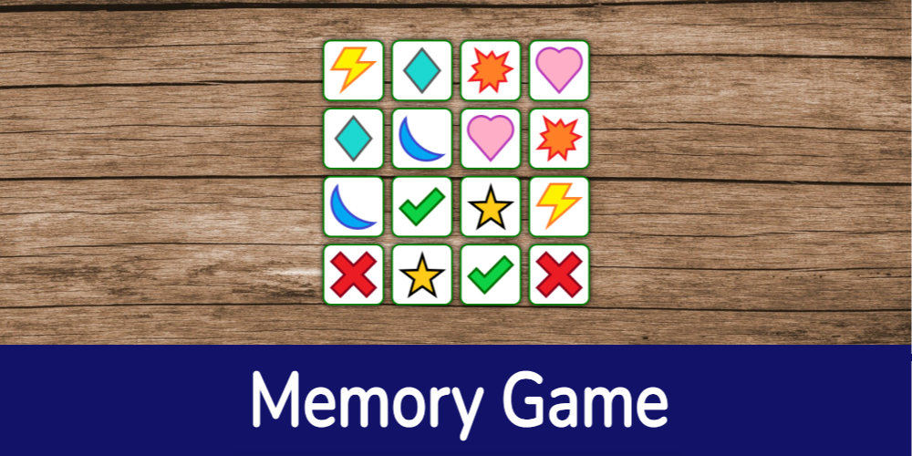

<!-- Page Title -->
<h1 align="center">Memory Game</h1>  

<!-- Title Image -->

  

<!-- Game Description -->

  <b>JavaScript Memory Game</b>

  A mobile-responsive memory game, brought to life with audio and various animations. Made possible with vanilla CSS, jQuery, and confetti.js.

<!-- Links - Trailer, Play Game, Sources -->

  <a href="https://twit96.github.io/memory-game/"><b>Click to Play Now!</b></a>

